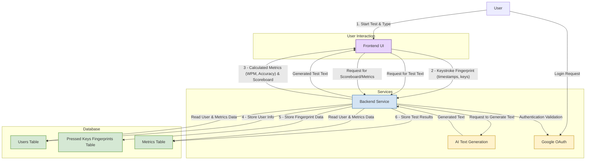

# Introduction

The Tucano Typing platform is a web-based application designed to help users practice and improve their typing skills. The platform consists of a frontend user interface and a backend service that work together to deliver a comprehensive typing test experience.

# Core Functionality

**User Interaction (Frontend)**: Users interact with a clean interface to select a typing test. During the test, every keystroke is captured with a precise timestamp, creating a "fingerprint" of the user's typing pattern. The frontend is also responsible for displaying the final performance metrics and a scoreboard.

**Text Generation and Data Processing (Backend)**: The backend dynamically generates text of a desired length for the typing tests using AI. Upon completion of a test, it receives the detailed fingerprint data from the frontend, analyzes it to calculate key performance metrics, and stores both the raw data and the calculated metrics.

**Performance Metrics**: The primary metrics calculated are typing speed, measured in words per minute (WPM), and accuracy.

# Authentication and Data Privacy

**Authentication**: User authentication is handled through Google OAuth, ensuring a secure and straightforward login process.

**User Control and Privacy**: Users have control over the privacy of their data. They can choose to make their results public or private. If a user opts for privacy, their data will be displayed anonymously on the public scoreboard, a setting managed by the backend.

# Database Structure

The application's database will feature three main tables:

**Users Table**: To store user information for authentication and profile management.

**Pressed Keys Fingerprints Table**: To log each individual keystroke with its corresponding timestamp (timestamp, pressed_key).

**Metrics Table**: To store the results of each typing test, including speed (wpm), accuracy, and the timestamp of when the metrics were calculated.


***




***

# Typing interface

In the typing test page, the page will capture the user key pressed events.
If the character is the correct key to be pressed, the letter should be displayed in green. Otherwise, red. The keys that were not pressed yet should be displayed in gray or with the default color.
Each character should be displayed with a separated tag to provide control over the styles and behavior.


```html
<div class="screenBasic-word">
   <div class="letter letter--basic screenBasic-letter     is-wrong animate animate--shake animate--d-025" id="id0.3502432967440461" aria-describedby="tooltip_0x2pwgit4u" data-wrong="f">M</div>
   <div class="letter letter--basic screenBasic-letter     is-right" data-wrong="s">a</div>
   <div class="letter letter--basic screenBasic-letter     is-wrong animate animate--shake animate--d-025" data-wrong="f">k</div>
   <div class="letter letter--basic screenBasic-letter     is-active">e</div>
   <div class="letter letter--basic screenBasic-letter    ">&nbsp;</div>
</div>
```

*** 

# Typing test modes

I'd like to have those three typing modes:

### Fixed text length

- 300 words, 1000 words, etc.
- the last tipped character will end the test (if the key is pressed correctly or not)

### fixed time (1min, 3min, 5min, 10min)

- In this case the text should be unlimited

### unlimited text and time

- a special button (html tag or keyboard key) should define when the test finishes
